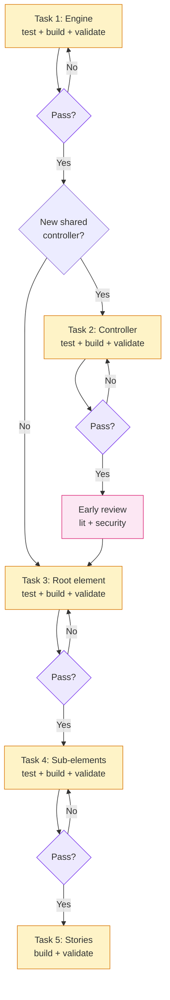

# Unified Pipeline Design

**Status:** Draft — decisions resolved, ready for implementation planning
**Date:** 2026-03-29

---

## Problem

The current workflow has 7+ entry points (complex, simple, trivial, modify-planned,
modify-ad-hoc, bug-fix, rebuild, extract-pattern), each with its own pipeline definition.
This creates:

1. **Human classification burden** — the user must decide "is this complex or simple?" before
   starting, when that's a property the machine can derive from the spec
2. **Stage duplication** — reviewer dispatch, patch loop, and Post-Reviewer Protocol are
   re-described in 9+ skill files
3. **Inconsistent TDD** — some skills write tests first (build-elements, build-engine, fix-bug),
   others don't enforce it (modify-component)
4. **No self-validation standard** — agents can't uniformly validate their own work because
   the "test first" pattern isn't universal

## Design

### Core Principle

**One pipeline. Variable scope. TDD always.**

Every task follows the same stage sequence. The orchestrator determines which stages are
needed and what scope each stage operates at. The human confirms the classification, then
the pipeline runs.

### The Pipeline

```
Evaluate → [Brainstorm] → Spec → Scaffold → Plan → Execute → Review → Validate → Finish
```

Stages that don't apply are skipped with a logged reason. The Execute stage iterates
through the plan's tasks, each following a RED → GREEN TDD cycle.

### Stage Library

#### 1. Evaluate

The orchestrator reads the user's intent and the codebase to classify the task.

**Inputs:** User prompt, codebase state
**Outputs:** Task classification, scope assessment, proposed pipeline

**Classification logic:**

```
1. Parse intent — what is the user asking for?
   ├─ Extract/promote a pattern       → PATTERN EXTRACTION
   ├─ Update/bump a dependency        → DEPENDENCY UPDATE
   ├─ Refactor (restructure, no behavior change) → REFACTOR
   └─ Component work                  → continue to step 2
2. Check: does src/components/{name}/ exist?
   ├─ No  → NEW COMPONENT
   │       Check: does a spec exist at docs/specs/{name}.spec.md?
   │       ├─ Yes → read spec, derive complexity
   │       └─ No  → Spec stage will create one
   │
   └─ Yes → EXISTING COMPONENT
           Parse intent:
           ├─ Bug report (broken, doesn't work, violates spec) → BUG FIX
           └─ Feature/change (add, change, support) → MODIFICATION
3. Check: does a plan exist in docs/vollgas/plans/ for this work?
   ├─ Yes → read plan, validate it (check for gaps, ambiguities, stale assumptions)
   │        Plan becomes input to Spec and Plan stages — does NOT bypass the pipeline
   └─ No  → proceed without plan
```

**Complexity derivation (for new components):**

```
Read spec → count sub-elements:
├─ 0 elements or 1 element, no state, no keyboard, no events → TRIVIAL
├─ 1 element with state or keyboard or events             → SIMPLE
└─ 2+ elements (compound structure)                        → COMPLEX
    └─ Check: needs engine? registry? shared controller?
```

**Output to human (examples):**

```
Task: New complex component — Checkbox
Scope: compound (root + indicator), engine, form controller
Plan: none
Stages: Brainstorm → Spec → Scaffold → Plan → Execute (4 tasks) → Review (full fleet) → Validate → Finish
Confirm? [y/n]
```

```
Task: Modify existing — Accordion, add loopFocus property
Scope: root element, controller config, 1 new property
Plan: docs/vollgas/plans/2026-03-20-accordion-loop-focus.md (validated, no gaps)
Stages: Spec (update) → Plan → Execute (2 tasks) → Review (targeted) → Validate → Finish
Confirm? [y/n]
```

```
Task: Bug fix — Accordion, keyboard selection doesn't fire grund-change
Scope: root element, 1 event path
Stages: Plan → Execute (1 task: reproduce + fix) → Review (targeted) → Validate → Finish
Confirm? [y/n]
```

```
Task: Refactor — Accordion engine, extract state machine pattern
Scope: engine file, existing tests must continue to pass
Stages: Plan → Execute (2 tasks: verify coverage, refactor) → Review (targeted) → Validate → Finish
Confirm? [y/n]
```

#### 2. Brainstorm

Design exploration for new complex components.

**Runs when:** New complex component, or any task where the user's intent requires design
decisions (trade-offs, ARIA pattern selection, compound structure).
**Skips when:** Simple/trivial components, modifications, bug fixes, refactors.

**Invokes:** `vollgas:brainstorming` — explores intent, requirements, reference
implementations, and design trade-offs. Outputs decisions and constraints that feed into
the Spec stage.

**Why a separate stage:** The Spec stage codifies decisions. It should not also be making
them. Separating exploration from codification prevents specs that encode the first idea
rather than the best idea.

#### 3. Spec

Create or update the component specification.

**Runs when:** New component (always), modification that changes public API, bug fix that
reveals a spec gap.
**Skips when:** Bug fix with clear spec, modification with no API change, refactor,
pattern extraction, dependency update.

**Inputs:** Brainstorm output (if applicable), user intent, APG pattern (via /apg),
vocabulary, component-shapes
**Outputs:** `docs/specs/{name}.spec.md`

Based on current `/component-spec` skill. The orchestrator invokes it, not the human.

#### 4. Scaffold

Create file structure, types, context interfaces, and barrel exports.

**Runs when:** New component.
**Skips when:** Existing component (files already exist).

**Inputs:** Spec
**Outputs:** Directory structure, `types.ts`, context interfaces, element stubs, barrel file

Based on current `/scaffold` skill.

#### 5. Plan

Decompose the work into small, independently validatable tasks.

**Runs always.** Even a single-task bug fix gets a plan (the plan is just one task).

**Inputs:** Spec, existing codebase, classification from Evaluate, existing plan (if any)
**Outputs:** Ordered list of tasks with contracts and validation criteria

**Plan rules** (from workflow-guidelines.md Section 1):
- Plans describe WHAT each task must satisfy, not HOW to implement it
- Use contracts, interfaces, invariants, pseudocode — not copy-paste code
- Each task must be small enough for one agent context window
- Each task must have an unambiguous validation command

**Task format:**

```markdown
### Task N — {title}
**Scope:** {which files are read and written}
**Contract:** {what the implementation must satisfy — invariants, interfaces, constraints}
**Validation:** {command to verify — typically `npm run test:run -- {path}`}
**Dependencies:** {which tasks must complete first, if any}
```

**Example plan — new complex component (Checkbox):**

```markdown
### Task 1 — Engine
**Scope:** engine/checkbox.engine.ts, engine/checkbox.engine.test.ts
**Contract:** Pure class, no DOM/Lit. Owns checked + indeterminate state.
  toggle() returns { checked, indeterminate }. Delegates selection to
  SelectionEngine if multi-value. syncFromHost(snapshot) for controlled mode.
**Validation:** `npm run test:run -- src/components/checkbox/engine/`

### Task 2 — Root element + context wiring
**Scope:** root/checkbox.ts, context/, tests/checkbox.test.ts (smoke + core)
**Contract:** @provide context. Instantiate engine. Map properties to engine
  state. Dispatch grund-checked-change on toggle. FormController for form
  participation. Host-level click listener for label-for association.
**Validation:** `npm run test:run -- src/components/checkbox/`

### Task 3 — Indicator element
**Scope:** indicator/checkbox-indicator.ts, tests (indicator-specific)
**Contract:** @consume context. Reflect checked/indeterminate via data
  attributes. Expose ::part(indicator). Dev-mode warning if used outside
  grund-checkbox.
**Validation:** `npm run test:run -- src/components/checkbox/`

### Task 4 — Stories
**Scope:** stories/checkbox.stories.ts
**Contract:** Zero-config default story with play function. Stories for:
  checked, indeterminate, disabled, readonly, slot composition, controlled,
  form integration. Default story has no args binding.
**Validation:** Storybook renders, play functions pass.
```

**Example plan — bug fix:**

```markdown
### Task 1 — Reproduce and fix
**Scope:** tests/accordion.test.ts, root/index.ts
**Contract:** Write a test that fails because keyboard selection doesn't fire
  grund-change. Apply the minimal fix. Existing tests must not break.
**Validation:** `npm run test:run -- src/components/accordion/`
```

**Example plan — refactor:**

```markdown
### Task 1 — Verify test coverage
**Scope:** tests/accordion.test.ts
**Contract:** Every code path in the engine's toggle/expand/collapse methods
  must have a corresponding test. Add tests for any uncovered paths. All
  tests pass (no RED phase — these test existing behavior).
**Validation:** `npm run test:run -- src/components/accordion/`

### Task 2 — Refactor engine
**Scope:** engine/accordion.engine.ts
**Contract:** Replace if/else resolution with state machine pattern. All
  existing tests must continue to pass. No public API changes.
**Validation:** `npm run test:run -- src/components/accordion/`
```

#### 6. Execute

Iterate through the plan's tasks. Each task follows a TDD cycle.

**Runs always.**

**For each task in the plan:**

```
1. Read the task's contract and scope
2. Test (RED): Write tests that encode the contract — tests must fail
3. Build (GREEN): Implement until tests pass — minimal code only
4. Self-validate: Run the validation command — all tests must pass
5. If validation fails: diagnose and fix, do not proceed
6. If validation passes: move to next task
```

**Exception — refactor tasks:** Step 2 may produce tests that pass immediately (verifying
existing behavior). This is expected. Step 3 is the refactoring. Step 4 confirms tests
still pass.

**Context management:** Each task is dispatched as a subagent with:
- The task definition (contract, scope, validation command)
- The spec (if applicable)
- Relevant reference files (lit-patterns, headless-contract, etc.)
- Current codebase state

The orchestrator is a thin coordination layer. It does not implement code — it dispatches
task agents and validates their output.

**Exception — new shared controllers:** When a task creates a new shared controller in
`src/controllers/`, the orchestrator runs a targeted early review (lit-reviewer +
security-reviewer) before proceeding to tasks that build on it. Bad shared abstractions
propagate to all consumers — catching issues early prevents cascading rework.

#### 7. Review

Convention, security, and accessibility audit via the reviewer fleet.

**Runs always.** Runs once, after all tasks are complete.

**Reviewer selection — derived from the diff:**

The orchestrator reads `vollgas/refs/reviewer-dispatch.md` and classifies the changes by
type using the change-type selection table. This replaces per-skill reviewer selection.

| What changed | Reviewers |
|---|---|
| Any element file | lit-reviewer, accessibility-reviewer, headless-reviewer, security-reviewer |
| Public API (properties, events) | api-reviewer |
| Tests | test-reviewer |
| Engine/controller | lit-reviewer, code-quality-reviewer |
| Everything (new component) | Full fleet (all 7) |

**security-reviewer runs on every change type.**

**Lifecycle (unchanged):**
1. Run `vollgas:smallest-diff` (catch implementation noise before review)
2. Dispatch selected reviewers in parallel
3. Collect findings
4. Patch loop: fix blockers, re-run only flagged reviewers (max 2 iterations)
5. Run `vollgas:smallest-diff` again (catch patch-fix noise)
6. Post-Reviewer Protocol: any fix after reviewers pass → write to
   `vollgas/.feedback-queue.md`

**Why one review cycle works with TDD:** Tests already validate functional correctness.
Reviewers focus on what tests can't catch: ARIA patterns, headless contract compliance,
security patterns, API naming conventions, Lit lifecycle correctness.

#### 8. Validate

Toolchain verification. Read-only — no code changes.

**Runs always.**

Unchanged from current `/validate-build`:
1. Lint
2. TypeScript build
3. Tests (all components)
4. CEM analysis + drift check
5. Export and registration validation
6. Bundle size check
7. Summary
8. Process feedback queue (if exists)

#### 9. Finish

Integration decision.

**Runs always.**

Unchanged from current `vollgas:finishing-a-development-branch`:
- Commit
- Branch management
- PR decision (human)

---

### Orchestrator

**Location:** `vollgas/skills/orchestrate/SKILL.md` — a workflow skill, not a vollgas
skill. This allows the project to decouple from Vollgas in the future. The orchestrator
interacts with the user only at the Evaluate stage (confirmation) and the Finish stage
(integration decision). All other stages run autonomously.

**Architecture:** The orchestrator is a **thin coordination layer** that dispatches
subagents for heavyweight stages. It does not implement code, write tests, or make design
decisions. It maintains pipeline state and passes context between stages.

| Stage | Execution model |
|---|---|
| Evaluate | Inline (orchestrator's own context) |
| Brainstorm | Subagent (invokes vollgas:brainstorming) |
| Spec | Subagent (heavyweight — reads APG, vocabulary, writes spec) |
| Scaffold | Subagent or inline (lightweight) |
| Plan | Inline (orchestrator reads spec, produces task list) |
| Execute | Subagent per task (each task gets fresh context) |
| Review | Subagent per reviewer (dispatched in parallel) |
| Validate | Inline (runs bash commands) |
| Finish | Inline (user interaction) |

**Responsibilities:**

1. **Evaluates** the intent (Stage 1)
2. **Composes** the pipeline (selects stages and scopes)
3. **Presents** the composition for human confirmation
4. **Plans** the task breakdown (Stage 5)
5. **Executes** tasks sequentially, validating each (Stage 6)
6. **Tracks** progress (which tasks completed, which remain)
7. **Handles** failures (task fails → diagnose, don't skip)

The orchestrator does NOT:
- Implement code (that's the Execute stage's task agents)
- Write tests (that's the Execute stage's task agents)
- Choose reviewers (that's derived from the diff in the Review stage)
- Make design decisions (that's the Brainstorm stage)
- Classify complexity without reading the spec/codebase

### What Happens to Current Skills

| Current skill | In the new model |
|---|---|
| `vollgas:brainstorming` | Invoked by the **Brainstorm stage** — unchanged |
| `/component-spec` | Basis for the **Spec stage** — invoked by orchestrator |
| `/scaffold` | Basis for the **Scaffold stage** — invoked by orchestrator |
| `/build-engine` | Absorbed into **Execute stage** (engine task) |
| `/build-controller` | Absorbed into **Execute stage** (controller task) |
| `/build-elements` | Absorbed into **Execute stage** (element tasks) |
| `/build-stories` | Absorbed into **Execute stage** (stories task) |
| `/quick-component` | Full pipeline at trivial scope — no separate skill needed |
| `/modify-component` | Full pipeline at modification scope — no separate skill needed |
| `/fix-bug` | Full pipeline at bug-fix scope — no separate skill needed |
| `/rebuild-component` | Full pipeline at rebuild scope — no separate skill needed |
| `/post-plan-review` | Absorbed into **Review stage** |
| `/validate-build` | Becomes the **Validate stage** — unchanged |
| `vollgas:smallest-diff` | Called by orchestrator in Review stage (before and after patch loop) |
| `/apg` | Called by Spec stage internally |
| `/audit-cross-component` | Called by orchestrator after Review for bug fixes |
| `/diagnose-failure` | Escalation from patch loop — unchanged |
| `vollgas:finishing-a-dev-branch` | Becomes the **Finish stage** — unchanged |

**Orchestrated as separate paths (same pipeline, different scope):**
- `/extract-pattern` → Evaluate classifies as PATTERN EXTRACTION; Plan + Execute + Review + Validate + Finish
- `/update-dependency` → Evaluate classifies as DEPENDENCY UPDATE; Plan + Execute + Review + Validate + Finish

**Skills that remain independent (not orchestrated):**
- `/prepare-release` — release management, not development work
- `/review-system-health` — meta-workflow maintenance
- `/deprecate` — API lifecycle, typically part of a modification

### TDD Protocol

Universal. Every task follows this:

```
1. Spec defines the contract (WHAT)
2. Plan decomposes into tasks with contracts (WHAT per task)
3. Tests encode each task's contract (HOW TO VERIFY)
4. Implementation satisfies each task's contract (HOW TO BUILD)
```

**Why this order matters for agents:**
- Writing tests from the contract (not from the implementation) prevents tautological tests
- Failing tests give agents an unambiguous success criterion
- Agents can run tests after every change to self-validate
- Small tasks with clear validation = fast feedback loops

**TDD modes:**

| Mode | RED phase | GREEN phase | When |
|---|---|---|---|
| Standard | Tests fail (missing behavior) | Implement until tests pass | New features, modifications |
| Reproduce | Test fails (captures bug) | Fix until test passes | Bug fixes |
| Coverage | Tests pass (verify existing behavior) | Refactor, tests still pass | Refactors |

**Enforcement:** The orchestrator validates each task's output before proceeding to the
next task. If tests don't pass, the task agent diagnoses and retries. The orchestrator
does not skip failing tasks.

---

## Diagrams

### Pipeline Overview

```mermaid
flowchart LR
    classDef stage fill:#dbeafe,stroke:#2563eb
    classDef optional fill:#dbeafe,stroke:#2563eb,stroke-dasharray:5 5
    classDef tdd fill:#fef3c7,stroke:#d97706
    classDef review fill:#fce7f3,stroke:#db2777
    classDef gate fill:#ede9fe,stroke:#7c3aed
    classDef done fill:#dcfce7,stroke:#16a34a

    INTENT(["Human intent"])
    EVAL["1. Evaluate\nclassify, derive scope"]:::stage
    BRAIN["2. Brainstorm\ndesign exploration"]:::optional
    SPEC["3. Spec\ncreate or update"]:::optional
    SCAFFOLD["4. Scaffold\nfiles, types, context"]:::optional
    PLAN["5. Plan\ntask breakdown\ncontracts + validation"]:::stage

    subgraph EXECUTE["6. Execute — per task"]
        direction TB
        TASK["Read task contract"]:::tdd
        TEST["Test — RED\nwrite from contract"]:::tdd
        BUILD["Build — GREEN\nmake tests pass"]:::tdd
        CHECK{"Tests\npass?"}
        NEXT["Next task"]:::tdd
        TASK --> TEST --> BUILD --> CHECK
        CHECK -- No --> BUILD
        CHECK -- Yes --> NEXT
    end

    subgraph REVIEW["7. Review"]
        direction TB
        SD1["smallest-diff"]:::stage
        DISPATCH["Dispatch reviewers\nderived from diff"]:::review
        RV["lit, accessibility, headless\napi, test, security\ncode-quality"]:::review
        PATCH{"All PASS?"}
        FIX["Patch loop\nmax 2 iterations"]
        SD2["smallest-diff"]:::stage
        PRP["Post-Reviewer\nProtocol"]:::review
        SD1 --> DISPATCH --> RV --> PATCH
        PATCH -- Fail --> FIX --> DISPATCH
        PATCH -- Pass --> SD2 --> PRP
    end

    VALIDATE["8. Validate\nlint, build, test, CEM\nexports, feedback queue"]:::gate
    FINISH(["9. Finish\ncommit, branch, PR"]):::done

    INTENT --> EVAL --> BRAIN --> SPEC --> SCAFFOLD --> PLAN --> EXECUTE
    NEXT --> REVIEW
    PRP --> VALIDATE --> FINISH
```



Dashed borders indicate stages skipped based on task type.

### Execute Detail — Complex Component



### Scope Variations

All paths follow the same pipeline. Stages marked `--` are skipped.

```
                    Evaluate  Brainstorm  Spec  Scaffold  Plan  Execute            Review       Validate  Finish
New complex         derive    yes         new   new       yes   engine→ctrl?→elem→stories  full fleet   yes       yes
New simple          derive    --          new   new       yes   elements→stories   full fleet   yes       yes
New trivial         derive    --          new   new       yes   element→story      full fleet   yes       yes
Modification        scope     --          upd?  --        yes   changed layers     targeted     yes       yes
Refactor            scope     --          --    --        yes   coverage→refactor  targeted     yes       yes
Bug fix             locate    --          --    --        yes   reproduce→fix      targeted     yes       yes
Pattern extraction  scope     --          --    --        yes   controller/utility targeted     yes       yes
Dependency update   scope     --          --    --        yes   update→verify      targeted     yes       yes
```

### Comparison

```
BEFORE (7+ entry points, human classifies):
  quick-component ──────────────────────────→ validate → finish
  component-spec → scaffold → build-engine → build-elements → build-stories → validate → finish
  component-spec → scaffold → build-elements → build-stories → validate → finish
  brainstorm → writing-plans → executing-plans → post-plan-review → validate → finish
  modify-component ─────────────────────────→ validate → finish
  fix-bug ──────────────────────────────────→ validate → finish
  rebuild-component → [hands off to planned]
  extract-pattern ──────────────────────────→ [independent]
  update-dependency ────────────────────────→ [independent]

AFTER (1 entry point, machine classifies):
  evaluate → [brainstorm] → spec → scaffold → plan → execute{test→build}* → review → validate → finish
  (scope varies per task type, stages and sequence are always the same)
```

---

## Migration

### Phase 1: Enforce TDD in existing skills (low risk, no structural change)
- Update `/modify-component` to require tests before implementation
- Verify `/build-elements` and `/build-engine` already follow RED → GREEN
- No orchestrator changes yet — existing skills continue to work

### Phase 2: Build the orchestrator (medium risk)
- Create `vollgas/skills/orchestrate/SKILL.md` with Evaluate + Plan logic
- Wire it to invoke existing skills as stages (thin wrapper)
- Keep existing skills functional — orchestrator calls them, doesn't replace them
- Test with one new component end-to-end, compare output quality with old pipeline

### Phase 3: Consolidate skills into stages (higher risk)
- Replace `/build-engine` + `/build-elements` with Execute stage task dispatch
- Absorb `/quick-component`, `/modify-component`, `/fix-bug` scope logic into orchestrator
- Absorb `/extract-pattern` and `/update-dependency` as orchestrator paths
- Remove intermediate review cycles (build-engine → lit-reviewer, build-controller → 3 reviewers)
- Keep the shared-controller early review exception
- Update CLAUDE.md to show single pipeline

### Phase 4: Retire old entry points
- Remove deprecated pipeline definitions from CLAUDE.md
- Archive old skill files (keep for reference, mark as deprecated)
- Update `vollgas/refs/workflow-guidelines.md` to reference the orchestrator
- Update `vollgas/refs/reviewer-dispatch.md` to remove per-skill references

---

## Resolved Decisions

1. **Orchestrator is a workflow skill** (`vollgas/skills/orchestrate/SKILL.md`), not a
   vollgas skill. This decouples the pipeline from Vollgas and allows future
   migration to other orchestration systems.

2. **One review cycle at the end.** TDD validates correctness at each task. Reviewers
   validate conventions, security, and accessibility — things tests can't catch.
   **Exception:** new shared controllers in `src/controllers/` get a targeted early review
   (lit + security) because bad shared abstractions propagate to all consumers.

3. **Plans are pipeline inputs, not separate paths.** If a plan exists, the orchestrator
   reads and validates it (checks for gaps, ambiguities, stale assumptions). The plan
   informs the Spec and Plan stages but does not bypass them. The pipeline is always the
   same; the plan provides additional context.

4. **`/extract-pattern` and `/update-dependency` are orchestrated** as separate paths
   through the same pipeline. The Evaluate stage classifies the intent, the Plan and
   Execute stages scope accordingly. Only `/prepare-release`, `/review-system-health`,
   and `/deprecate` remain independent.

5. **Plans use contracts, not code.** When the plan is the code, agents copy without
   judgment and reviewers degrade to "does this match the plan?" instead of "is this
   correct?" Plans describe WHAT and WHY. Agents decide HOW. (See workflow-guidelines.md
   Section 1.)

6. **Brainstorming uses `vollgas:brainstorming`.** Design exploration for new complex
   components is a separate stage that runs before Spec. This keeps the exploration skill
   reusable and avoids encoding design decisions prematurely.

7. **Smallest-diff runs twice in Review.** Once before reviewer dispatch (catches
   implementation noise) and once after the patch loop (catches fix noise).

8. **Refactoring is a first-class TDD mode.** Coverage verification (GREEN → GREEN)
   replaces the RED → GREEN cycle. The Plan stage produces "verify coverage" + "refactor"
   tasks. Tests must pass before AND after the refactor.

9. **The orchestrator dispatches subagents per task.** Each task gets a fresh context
   window with the task contract, spec, and relevant reference files. The orchestrator
   maintains pipeline state across tasks. This solves context window management for
   complex components.

10. **Complexity is a trade-off, not a reduction.** The current model distributes
    complexity across 7+ simple skills. The new model concentrates it in one orchestrator
    + a plan. The benefit is consistency, automation, and reduced human burden. The risk
    concentrates in the orchestrator's classification logic — mitigated by always
    presenting the classification for human confirmation.
